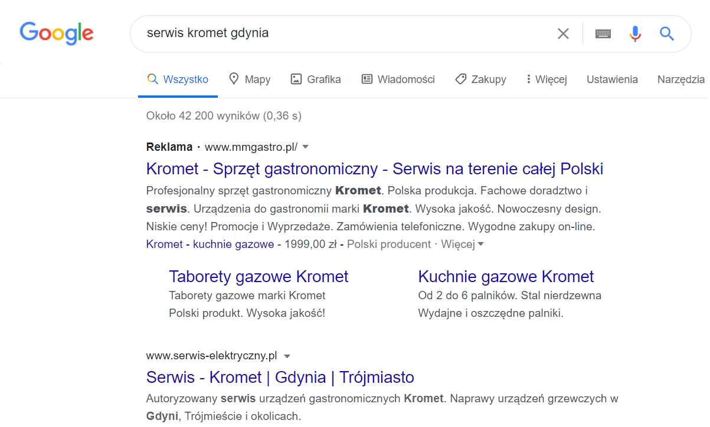
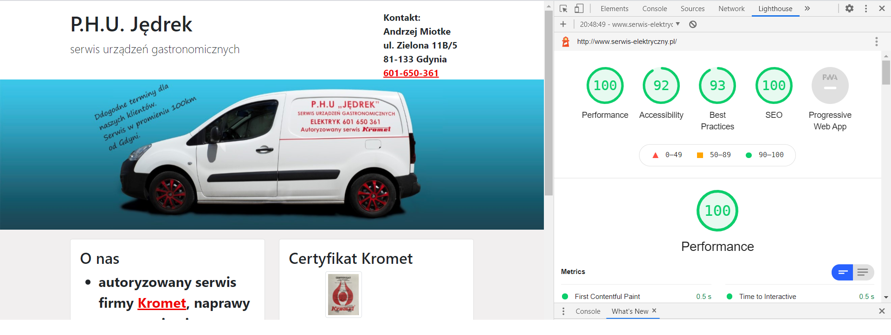

# Website for electrical service

http://www.serwis-elektryczny.pl/

This is my first website for a client. The front-end is made with Bootstrap. It features a simple contact form in PHP. 
In this project, I focused on SEO practices. With my client, we have chosen the long-tail keyword "serwis kromet gdynia". At this moment (14.03.2021) the website has 1st place on google search after entering this phrase. The old website had 10th place on google search.

To make sure my site is SEO-optimized, and high quality I used [Lighthouse](https://chrome.google.com/webstore/detail/lighthouse/blipmdconlkpinefehnmjammfjpmpbjk?hl=pl) add-on. Did audits and followed instructions until I was happy with the result. At this moment I'm proud of my work.

